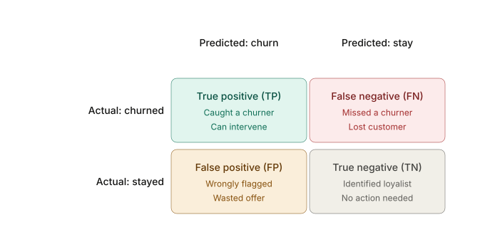

# Classification Metrics — Notes & Reference

> **Personal study notes built during Project 01 (Telco Customer Churn).**
> Reusable for every binary classification problem you'll work on.

---

## Table of Contents

1. [The Confusion Matrix](#1-the-confusion-matrix)
2. [Reading the Four Cells](#2-reading-the-four-cells)
3. [Metrics Derived from the Matrix](#3-metrics-derived-from-the-matrix)
4. [Why Metric Choice Matters — The Reasoning Chain](#4-why-metric-choice-matters--the-reasoning-chain)
5. [The Naive Baseline Test](#5-the-naive-baseline-test)
6. [The Cost Asymmetry Framework](#6-the-cost-asymmetry-framework)
7. [The Recall Trap (and the Precision Trap)](#7-the-recall-trap-and-the-precision-trap)
8. [Which Metric in Which Scenario](#8-which-metric-in-which-scenario)
9. [Tuning the Trade-off in Production](#9-tuning-the-trade-off-in-production)
10. [Workflow Checklist for Picking a Metric](#10-workflow-checklist-for-picking-a-metric)

---

## 1. The Confusion Matrix

A confusion matrix is a 2×2 grid that shows where a binary classifier got predictions right and where it got them wrong. For customer churn, the *positive* class is the customer who churns (the one you want to catch) and the *negative* class is the customer who stays.



---

## 2. Reading the Four Cells

The two diagonal cells (TP and TN) are where the model agreed with reality. The two off-diagonal cells are the mistakes — and in churn they are very different kinds of mistakes.

- **True Positive (TP)** — Caught a churner. You can intervene with a retention offer.
- **False Negative (FN)** — Missed a churner. The customer leaves quietly. **Usually the most expensive error** in churn, because losing a customer costs far more than a retention offer.
- **False Positive (FP)** — Wrongly flagged a loyal customer. You waste a retention offer on someone who was going to stay anyway.
- **True Negative (TN)** — Correctly identified a loyalist. No action needed.

That asymmetry is why churn problems rarely chase plain accuracy. A model that predicts *"stay"* for everyone gets 95% accuracy when only 5% of customers churn — and is useless in production.

---

## 3. Metrics Derived from the Matrix

Most numbers quoted in churn dashboards are just ratios of these four cells.

### i) Precision (for class = Yes / Churn)

Of the customers the model flagged as likely-to-churn, what fraction actually churned? (Avoids false alarms.)

$$\text{Precision} = \frac{TP}{TP + FP}$$

Low precision means the retention budget is being wasted on customers who would have stayed anyway.

### ii) Recall (Sensitivity / True Positive Rate) (for class = Yes / Churn)

Of the customers who actually churned, what fraction did the model catch? (Avoids missed churners.)

$$\text{Recall} = \frac{TP}{TP + FN}$$

Low recall means silent losses — churners walking out the door undetected.

### iii) F1-score

Harmonic mean of precision and recall — a balanced single number. Useful when classes are imbalanced.

$$F_1 = 2 \cdot \frac{\text{Precision} \cdot \text{Recall}}{\text{Precision} + \text{Recall}} = \frac{2\,TP}{2\,TP + FP + FN}$$

The harmonic mean (rather than arithmetic) **punishes extremes** — you can't get a high F1 by sacrificing one metric for the other.

### iv) ROC-AUC

Threshold-independent measure of how well the model separates the two classes.

$$\text{TPR} = \frac{TP}{TP + FN}, \qquad \text{FPR} = \frac{FP}{FP + TN}$$

$$\text{ROC-AUC} = \int_{0}^{1} \text{TPR}\bigl(\text{FPR}^{-1}(t)\bigr)\, dt$$

$$\text{ROC-AUC} = P\bigl(s(x^{+}) > s(x^{-})\bigr) = \frac{1}{|\mathcal{P}||\mathcal{N}|} \sum_{i \in \mathcal{P}} \sum_{j \in \mathcal{N}} \mathbb{1}\!\left[s_i > s_j\right] + \tfrac{1}{2}\,\mathbb{1}\!\left[s_i = s_j\right]$$

where $\mathcal{P}$ and $\mathcal{N}$ are the positive (churn) and negative (stay) sets, and $s(\cdot)$ is the classifier score. **Intuition:** the probability that a randomly chosen churner gets a higher score than a randomly chosen stayer.

### v) PR-AUC (precision-recall AUC)

Especially good for imbalanced data; ROC-AUC can be optimistic when classes are skewed (which is the norm in churn — most customers stay).

$$\text{PR-AUC} = \int_{0}^{1} \text{Precision}\bigl(\text{Recall}^{-1}(r)\bigr)\, dr$$

$$\text{AP} = \sum_{k=1}^{n} \bigl(R_k - R_{k-1}\bigr)\, P_k$$

where $P_k$ and $R_k$ are precision and recall at the $k$-th threshold (sorted by descending score), with $R_0 = 0$.

### vi) Accuracy

$$\text{Accuracy} = \frac{TP + TN}{TP + TN + FP + FN}$$

Equivalently, in terms of total samples $N = TP+TN+FP+FN$:

$$\text{Accuracy} = \frac{\text{Correct Predictions}}{\text{Total Predictions}} = \frac{TP + TN}{N}$$

Accuracy is the most intuitive metric but the least useful one for churn — it is dominated by the majority class and rewards a *"predict stay for everyone"* baseline.

### Bonus metrics worth knowing

- **Specificity (True Negative Rate):** $\text{TNR} = \frac{TN}{TN + FP}$ — Of actual negatives, what fraction did we correctly identify? Often paired with recall in medical screening.
- **Matthews Correlation Coefficient (MCC):** Balanced metric ranging from −1 to +1; robust on imbalanced data. $$\text{MCC} = \frac{TP \cdot TN - FP \cdot FN}{\sqrt{(TP+FP)(TP+FN)(TN+FP)(TN+FN)}}$$
- **Cohen's Kappa:** Measures agreement beyond chance. Useful when comparing classifier output to a "would chance alone produce this?" baseline.

---

## 4. Why Metric Choice Matters — The Reasoning Chain

Picking a metric is **not** a lookup table exercise. It's a chain of reasoning that connects the business goal to the math. Every classification project should follow this structure:

```
Business Goal
    ↓
What action does the model trigger?
    ↓
What is the cost of each kind of mistake (FP cost vs FN cost)?
    ↓
Which kind of mistake is more expensive? By how much?
    ↓
Pick the metric that punishes the expensive mistake more
    ↓
Track secondary metrics to guard against degenerate cases
```

### Worked example — Telco Customer Churn

1. **Business goal:** Maximize customer retention revenue.
2. **Action triggered:** The retention team contacts flagged customers with discounts, contract upgrades, or service offers.
3. **Cost of each mistake:**
   - FP (call a happy customer): ~$20–50 in discount + minutes of agent time. Customer might even appreciate the gesture.
   - FN (miss a real churner): lose customer lifetime value (~$1,000+) plus the cost to acquire a replacement (~$300–500).
4. **Asymmetry:** FN cost is roughly **20–50× FP cost.**
5. **Metric choice:** **Recall** as primary — it directly measures how few real churners we miss.
6. **Secondary metrics:** Track precision and F1 to avoid degenerate "flag everyone" behavior; PR-AUC for threshold-independent benchmarking.

> **Key insight:** Even if the asymmetry flips (e.g., the retention "offer" is a free $400 phone), the *reasoning structure* doesn't change. Only the answer does. Always state your cost assumption explicitly — the reasoning is reproducible, the conclusion is not.

---

## 5. The Naive Baseline Test

Before trusting any metric, ask: **"What would the dumbest possible model score on this metric?"**

For accuracy on the Telco dataset (73.4% No, 26.6% Yes):

- A model that **always predicts "No"** without learning anything:
  - Accuracy = **73.4%**
  - Recall (for churn class) = **0%**
  - Precision (for churn class) = undefined (zero predictions made)
  - F1 (for churn class) = **0**
  - Churners caught = **zero**

That's a 73.4%-accurate model that delivers zero business value. If your real model scores 76% accuracy, the +2.6% lift looks small — but if it catches even 30% of churners, the *business* impact is enormous.

> **Rule of thumb:** Any metric where a constant-prediction baseline scores well on an imbalanced dataset is a misleading metric for that dataset. Accuracy fails this test on imbalanced classification.

The naive baseline also tells you what your **minimum viable model** needs to beat. A model that scores 73.5% accuracy isn't 73.5% good — it's 0.1% better than predicting nothing.

---

## 6. The Cost Asymmetry Framework

Before training a model, write down a small cost table. This is the single most important artifact in classification work — and most analysts skip it.

| | Predicted Positive | Predicted Negative |
|---|---|---|
| **Actual Positive** | Reward: $V_{TP}$ (caught the case) | Cost: $C_{FN}$ (missed the case) |
| **Actual Negative** | Cost: $C_{FP}$ (false alarm) | Reward: $V_{TN}$ (correctly ignored) |

For Telco churn:

| | Predicted: Churn | Predicted: Stay |
|---|---|---|
| **Actual: Churn** | +retained revenue (~$1,200/yr) | **−$1,200/yr lost** |
| **Actual: Stay** | **−$30 wasted offer** | $0 (no action) |

The asymmetry $C_{FN} / C_{FP} \approx 40$ is what drives the metric choice. Different business → different ratio → different metric.

### Examples of asymmetry ratios

| Domain | Positive class | $C_{FN} / C_{FP}$ | Primary metric |
|---|---|---|---|
| Cancer screening | Has cancer | 100× or more | Recall (Sensitivity) |
| Spam filter | Email is spam | ~0.01× (FP is awful) | Precision |
| Credit card fraud detection | Transaction is fraud | 10–100× | Recall, with precision floor |
| Resume screening | Candidate is qualified | Roughly 1× | F1 or Accuracy |
| Search & rescue | Person is in the area | Very high | Recall |
| Movie recommendation | User will like the movie | ~1× | F1 or NDCG (ranking) |
| Loan default prediction | Borrower will default | Asymmetric, business-dependent | Cost-weighted, often PR-AUC |

---

## 7. The Recall Trap (and the Precision Trap)

Each metric has a degenerate failure mode you should anticipate.

### The Recall Trap

You can achieve **100% recall** trivially: predict "Yes" for every customer. Zero false negatives. Recall = 1.0. But:

- Precision collapses to the base rate (26.6% for Telco).
- The retention team is flooded with 7,043 calls.
- The model has learned nothing useful.

> **Fix:** Track precision as a guardrail. State an acceptable floor (e.g., "precision must stay ≥ 0.5"). Or use F1, which can't be gamed this way.

### The Precision Trap

You can achieve **near-100% precision** by predicting "Yes" only on the one customer you're most confident about, and "No" on everyone else. Almost zero false positives. Precision ≈ 1.0. But:

- Recall is microscopic — you've caught one churner out of hundreds.
- The model is technically "always right" but operationally useless.

> **Fix:** Track recall as a guardrail. Or use F1.

### Why F1 exists

F1 is the diplomatic answer to both traps. The harmonic mean structure means **F1 is high only when both precision AND recall are high.** You can't game it by extremizing one side.

> **But:** F1 implicitly assumes the cost of FP and FN are equal. If they're not (as in churn), F1 is the wrong choice — even though it's safer than precision or recall alone. Use $F_\beta$ to weight one side:
> $$F_\beta = (1+\beta^2) \cdot \frac{\text{Precision} \cdot \text{Recall}}{\beta^2 \cdot \text{Precision} + \text{Recall}}$$
> $\beta > 1$ favors recall (e.g., $F_2$ for medical screening); $\beta < 1$ favors precision (e.g., $F_{0.5}$ for spam).

---

## 8. Which Metric in Which Scenario

This is the cheat-sheet you'll come back to. **The metric depends on the cost structure, not the technique.**

### Quick decision tree

```
Is the dataset balanced (~40-60% positive)?
├── Yes → Accuracy is OK as a quick check; report F1 or AUC for rigor.
└── No (imbalanced) → Accuracy is misleading. Continue.
    │
    Is the positive class the one you care about?
    ├── Yes → continue
    └── No → flip the class definition, then continue.
        │
        What's worse: missing a positive case (FN), or a false alarm (FP)?
        ├── Missing is much worse → Recall (with precision floor)
        ├── False alarms much worse → Precision (with recall floor)
        ├── Roughly equal → F1
        └── Cost unclear / want threshold-independent → PR-AUC (preferred over ROC-AUC on imbalanced data)
```

### Scenario-by-scenario reference

| Scenario | Primary Metric | Secondary | Why |
|---|---|---|---|
| **Balanced binary classification** (e.g., sentiment Yes/No, ~50/50) | Accuracy or F1 | ROC-AUC | Both classes matter equally; accuracy is meaningful. |
| **Churn / retention** (cheap intervention, expensive loss) | **Recall** | Precision, F1, PR-AUC | FN cost >> FP cost. Catch as many churners as possible. |
| **Medical screening** (initial test for disease) | **Recall / Sensitivity** | Specificity, PR-AUC | Missing a sick patient is catastrophic; false alarms get filtered by follow-up tests. |
| **Medical diagnosis** (final / confirmatory) | **Precision** | Recall | A false-positive diagnosis can lead to harmful treatment. |
| **Spam filtering** | **Precision** | Recall | Blocking a real email is far worse than letting spam through. |
| **Fraud detection** (initial flag) | Recall, often with precision floor | PR-AUC, F1 | Catch fraud; tolerate some false positives that human reviewers filter. |
| **Fraud detection** (auto-block decision) | **Precision** | Recall | Blocking a real transaction frustrates customers and costs revenue. |
| **Credit default prediction** | Cost-weighted score (sometimes PR-AUC) | Recall, precision | Defaults are expensive but blanket rejection is also expensive — explicit cost ratio matters. |
| **Resume / candidate screening** | F1 or Recall | Precision | Missing a good candidate has long-term cost; false positives just get filtered in interview. |
| **Information retrieval / search ranking** | Precision@k, NDCG, MAP | Recall, PR-AUC | Users only see top-k results; ordering matters more than total catch rate. |
| **Recommender systems** | NDCG, Precision@k, MAP | Recall@k | Same logic as search — top-k positions are all that matter. |
| **Anomaly / intrusion detection** | **Recall**, then **Precision** | F1, PR-AUC | Don't miss anomalies; false positives are tolerable up to a point. |
| **Quality control / defect detection in manufacturing** | **Recall** | Precision | Letting a defect ship can damage brand or hurt customers. |
| **Autonomous driving / safety-critical perception** | **Recall** (with very tight precision floor) | — | Missing a pedestrian is worse than over-cautious braking. |
| **Search & rescue / military target detection** | **Recall** | Precision (resource constraint) | Missing the target is unacceptable; team can verify positives. |
| **Marketing campaign targeting** (with budget cap) | **Precision** | Recall (subject to budget) | Limited budget means each contact must be worth it. |
| **Marketing — unlimited reach** (e.g., free email) | **Recall** or **F1** | Precision | Cost per send is near-zero; coverage matters. |
| **Imbalanced classification with unknown business cost** | **PR-AUC** | F1, ROC-AUC | Threshold-independent and not optimistic on skew. |
| **Model comparison / ranking quality** | **ROC-AUC** | PR-AUC | Threshold-independent and easy to communicate. |
| **Ranking / probabilistic forecast quality** | Brier score, Log loss | Calibration plots | Care about probability calibration, not just classification. |

### Common pitfalls

- **Picking accuracy on imbalanced data.** Always test against the constant-prediction baseline.
- **Picking ROC-AUC on heavily imbalanced data.** ROC-AUC averages over both classes and looks optimistic when negatives dominate. Use PR-AUC instead.
- **Picking precision because it "sounds rigorous."** Precision is appropriate only when FP is expensive.
- **Picking F1 by default without checking cost asymmetry.** F1 assumes equal cost — if cost is asymmetric, $F_\beta$ or business-cost-weighted metrics are better.
- **Reporting only one metric.** Always report at least 3 (e.g., precision, recall, F1) plus the confusion matrix. Single-number summaries hide failure modes.
- **Optimizing for a metric that doesn't match production reality.** If production runs at a fixed threshold, evaluate at that threshold — not at the threshold that maximizes some validation metric.

---

## 9. Tuning the Trade-off in Production

You usually can't maximize both precision and recall — lowering the model's probability threshold catches more churners (↑ recall) but also flags more loyalists (↓ precision). The right operating point depends on the cost ratio.

If losing a customer is worth, say, 10 retention offers, you would tolerate quite a few false positives to drop your false negatives. Practically, this means:

- Plot the **precision-recall curve** and pick a threshold by business cost, not by F1.
- Report **PR-AUC** alongside ROC-AUC on imbalanced data.
- Track **recall at a fixed precision** (or vice versa) over time, since the underlying churn rate drifts.

### Threshold selection in practice

A trained classifier outputs a probability $p \in [0, 1]$. The default decision rule is "predict positive if $p > 0.5$" — but 0.5 is arbitrary and almost never optimal.

```python
# Example: pick the threshold that achieves recall ≥ 0.80
from sklearn.metrics import precision_recall_curve
precisions, recalls, thresholds = precision_recall_curve(y_true, y_scores)
mask = recalls[:-1] >= 0.80   # drop the trailing element
best_idx = precisions[:-1][mask].argmax()
best_threshold = thresholds[mask][best_idx]
```

In production, the threshold is a **business knob**, not a model parameter. It should be reviewed when business conditions change (budget cuts, new product, changing churn base rate).

### Operating point reports

The clearest way to communicate model performance to a business stakeholder is an **operating curve table**:

| Threshold | Precision | Recall | F1 | Customers flagged | Churners caught |
|---|---|---|---|---|---|
| 0.30 | 0.45 | 0.85 | 0.59 | 1,800 | 510 |
| 0.50 | 0.62 | 0.65 | 0.63 | 950 | 390 |
| 0.70 | 0.81 | 0.40 | 0.54 | 410 | 240 |

This lets the retention manager pick the row that matches their budget, rather than the data scientist picking it in isolation.

---

## 10. Workflow Checklist for Picking a Metric

For every new classification project, run through this list **before training a model**:

1. **State the business goal in one sentence.** ("Maximize retained subscription revenue.")
2. **Identify what action the model triggers.** Is it cheap (an email) or expensive (a free phone, a denial)?
3. **Define the positive class.** It should be the one the business cares about catching.
4. **Compute the base rate.** What % of the data is positive? If under 10–20%, you're in imbalanced territory.
5. **Compute the naive baseline.** What does "always predict majority" score on each metric? Any metric where the baseline scores well is misleading.
6. **Estimate the cost ratio $C_{FN}/C_{FP}$.** Even a rough number (e.g., "roughly 10×") is far better than no number.
7. **Pick the primary metric** based on the cost asymmetry. State your assumption explicitly.
8. **Pick 2–3 secondary metrics** as guardrails against degenerate behavior.
9. **Document the threshold strategy.** Default 0.5? Tuned for a precision floor? Cost-weighted?
10. **Re-evaluate when business conditions change.** Metric choice is not a one-time decision.

> **The single most important habit:** State your cost assumption *in writing* in the notebook or report. If the assumption is wrong, the conclusion will be wrong — but at least the next person can find the bug.

---

## Appendix — Quick formula reference

$$
\begin{aligned}
\text{Accuracy}    &= \frac{TP + TN}{TP + TN + FP + FN} \\[6pt]
\text{Precision}   &= \frac{TP}{TP + FP} \\[6pt]
\text{Recall (TPR / Sensitivity)} &= \frac{TP}{TP + FN} \\[6pt]
\text{Specificity (TNR)} &= \frac{TN}{TN + FP} \\[6pt]
\text{FPR}        &= \frac{FP}{FP + TN} = 1 - \text{Specificity} \\[6pt]
F_1               &= \frac{2 \cdot TP}{2 \cdot TP + FP + FN} \\[6pt]
F_\beta           &= (1+\beta^2) \cdot \frac{\text{Precision} \cdot \text{Recall}}{\beta^2 \cdot \text{Precision} + \text{Recall}} \\[6pt]
\text{MCC}        &= \frac{TP \cdot TN - FP \cdot FN}{\sqrt{(TP+FP)(TP+FN)(TN+FP)(TN+FN)}}
\end{aligned}
$$

---

*Notes by Rahul Das — Project 01 (Telco Customer Churn), Data Science Portfolio.*
